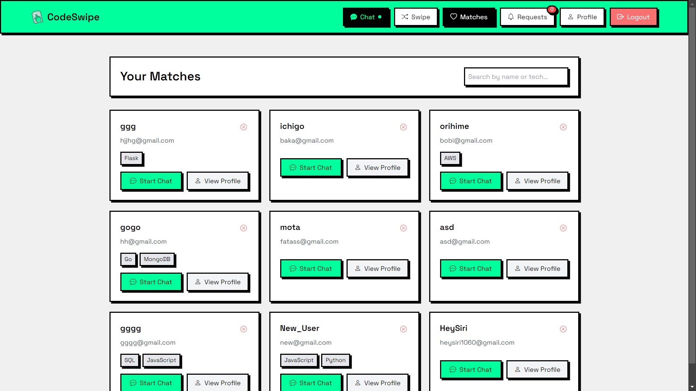
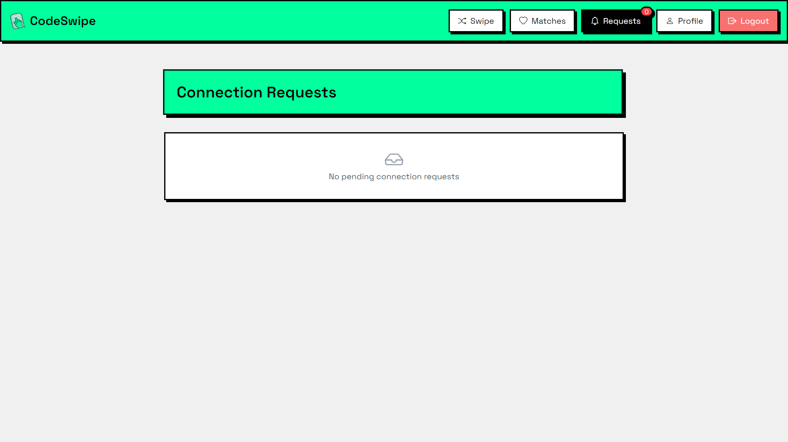
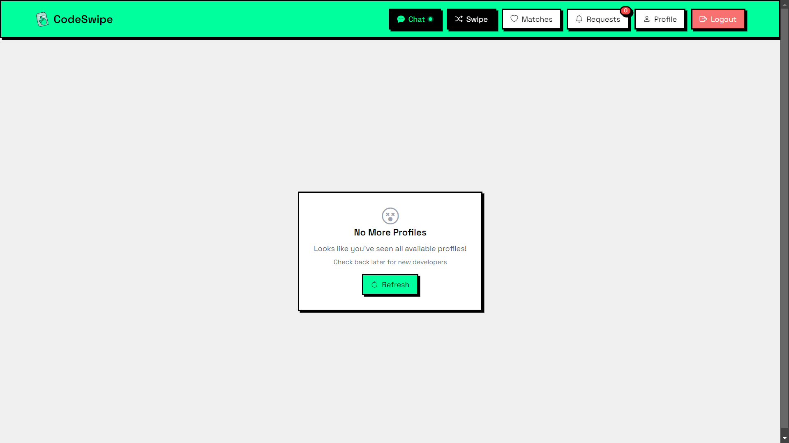
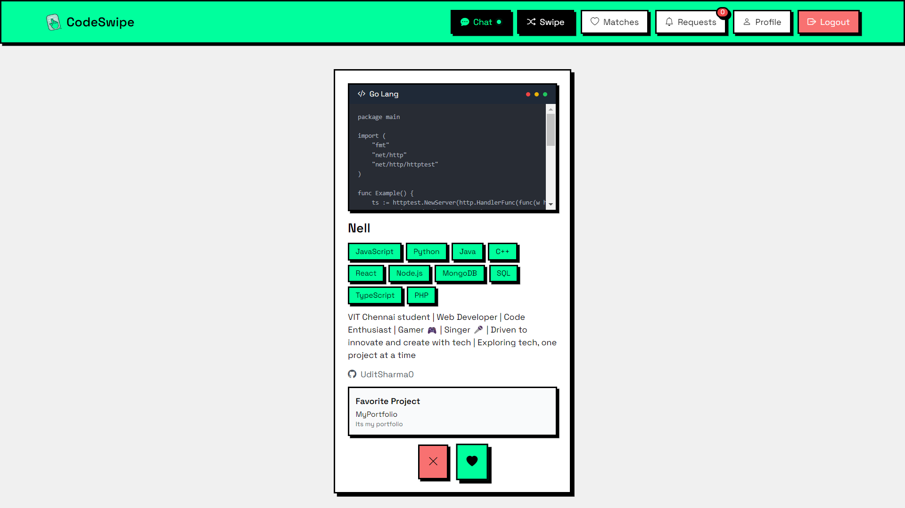

# 💻 CodeSwipe - Developer Matching Platform

<div align="center">
  
  <p><em>Where Code Meets Connection</em></p>
</div>

[](https://choosealicense.com/licenses/mit/)
[](https://github.com/yourusername/codeswipe)

---

## 🚀 Overview

CodeSwipe is an innovative developer matching platform that connects programmers with their ideal coding partners through a swipe-based interface. Think of it as "Tinder for Developers" — but instead of dating profiles, users match based on coding skills, tech stacks, and project interests.

### ✨ Key Features

- 🔄 **Swipe-Based Matching System**: Find developers with complementary skills.
- 💬 **Real-Time Chat**: Seamlessly communicate with matches.
- 🛠 **Tech Stack Compatibility**: Match based on coding expertise.
- 📊 **Code Snippet Sharing**: Share snippets in real-time for collaboration.
- 👥 **Project Collaboration**: Explore and join exciting projects.
- 🔐 **Secure Authentication**: Robust and reliable security.
- 📱 **Responsive Design**: Optimized for all devices.

---

## 🛠 Tech Stack

### Frontend
- **React.js**
- **Tailwind CSS**
- **Framer Motion**
- **Socket.io Client**
- **Axios**

### Backend
- **Express.js**
- **MongoDB**
- **JWT Authentication**
- **Socket.io**

---

## 🚀 Getting Started

### 1. Clone the Repository
```bash
git clone https://github.com/Aayush-Duhan/CodeSwipe.git
cd CodeSwipe
```

### 2. Install Dependencies
#### Frontend
```bash
cd client
npm install
```
#### Backend
```bash
cd ../server
npm install
```

### 3. Set Up Environment Variables
Create a `.env` file in the `server` directory with the following:
```env
MONGO_URI=your_mongo_connection_uri
JWT_SECRET=your_jwt_secret_key
PORT=port_number
```

### 4. Run the Application
#### Backend
```bash
cd server
npm run dev
```
#### Frontend
```bash
cd client
npm start
```

---

## 📸 Screenshots

<div align="center">
  
  
  
  
  
</div>

---

## 🤝 Contributing

We welcome contributions! Here's how you can get started:

1. **Fork the Repository**
2. **Create Your Feature Branch**
   ```bash
   git checkout -b feature/AmazingFeature
   ```
3. **Commit Your Changes**
   ```bash
   git commit -m 'Add some AmazingFeature'
   ```
4. **Push to the Branch**
   ```bash
   git push origin feature/AmazingFeature
   ```
5. **Open a Pull Request**

---

## 👥 Team

- [Aayush](https://github.com/Aayush-Duhan) - Full Stack Developer
- [Udit Sharma](https://github.com/UditSharma04) - Full Stack Developer

---

## 📄 License

This project is licensed under the MIT License - see the [LICENSE](LICENSE) file for details.

---

## 🙏 Acknowledgments

- [Create React App](https://create-react-app.dev/) for the initial project setup
- [Tailwind CSS](https://tailwindcss.com/) for the amazing utility-first CSS framework
- [MongoDB Atlas](https://www.mongodb.com/cloud/atlas) for database hosting

---

<div align="center">
  <p>Made with ❤ for developers, by developers.</p>
  <p>© 2024 CodeSwipe. All rights reserved.</p>
</div>

